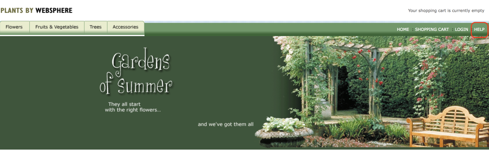

# IBM Client Developer Advocacy App Modernization Series

## Lab - Migrating Legacy JEE apps to IBM Cloud Private

### Working with Helm

## Overview

Helm is a package manager for Kubernetes. Package managers automate the process of installing, configuring, upgrading, and removing computer programs. Examples include the Red Hat Package Manager (RPM), Homebrew, and Windows® PackageManagement.

An application in Kubernetes typically consists of at least two resource types: a deployment resource, which describes a set of pods to be deployed together, and a service resource, which defines endpoints for accessing the APIs in those pods. In additional to a deployment and a service, an application will typically include other Kubernetes resource types such as ConfigMaps, Secrets, and Ingress.

For any application in Kubernetes, you will need to run several Kubernetes commands (`kubectl`) to create and configure resources. With Helm, instead of manually creating each resource separately, you can create many resources with one command (`helm install`). This greatly simplifies the process and allows you to manage the related resources as a single unit called a Helm chart.

Helm charts are stored in a Helm chart repository, which is an HTTP server that houses packaged charts and an `index.yaml` file. The `index.yaml` file has an index of all the charts in the repository. A chart repository can be any HTTP server that can serve YAML and .tar files and can answer GET HTTP requests. Therefore, you have many options for hosting your chart repository such as a Google Cloud Storage bucket, an Amazon S3 bucket or you can create your own web server. For this lab, we will be using a local test repository provided by Helm to  test the hosting of a chart repository.

In this lab you'll create a Helm chart repository and use it to deploy a small Java EE app to IBM Cloud Private  using the open source Helm CLI.

### Setup

1. If following this lab as part of an IBM instructor led workshop, login into to the terminal server with the credentials provided to you

2. Login to your designated ICP instance from the command line
   ```
   cloudctl login -a [ICP Master URL]
   ```
3. Initialize Helm
   ```
   helm init --client-only
   ```

### Step 1: Clone the Github repo that contains the code, build an Open Liberty image of the app and then push it to the IBM Cloud Kubernetes container registry

1. Login in [your Github account](https://github.com)

2. In the search bar at the top left type in `app-modernization-plants-by-websphere-jee6`

    

3. Select the repository `IBMAppModernization\app-modernization-plants-by-websphere-jee6` and then click on the **Fork** icon

4. Click the **Clone or download** button from your copy of the forked repo and copy the HTTPS URL to your clipboard

    

5. From the client terminal window clone the Git repo  with  the following commands  appending the HTTPS URL from your clipboard

    ```text
    git clone [HTTPS URL for NEW REPO]
    cd app-modernization-plants-by-websphere-jee6
    ```
6. Build the application .ear file using Maven by typing in (or copying and pasting in) the following command

    ```text
    mvn package
    ```

7. Build a docker image  by typing in (or copying and pasting in) the following (uncommented) commands

    ```bash
    # Note substitute your ICP namespace (e.g devnamespace009) for [YOUR_DEVNAMESPACE]
    docker build -t mycluster.icp:8500/[YOUR_DEVNAMESPACE]/pbw-mariadb-web:1.0.0 .
    ```

8. Log in to the ICP Private Container registry with the following command:

    ```bash
    # Login to the ICP private repository
    docker login mycluster.icp:8500
    ```

9. Push the image to the IBM Container registry by typing in (or copying and pasting in) the following (uncommented) commands

    ```bash
    # Note substitute your ICP namespace (e.g devnamespace009) for [YOUR_DEVNAMESPACE]
    docker push mycluster.icp:8500/[YOUR_DEVNAMESPACE]/pbw-mariadb-web:1.0.0
    ```

### Step 2: Look at the structure of the Helm chart for the Plants By WebSphere app

1. Login in [your Github account](https://github.com)

2. Select your fork  of the repository **app-modernization-plants-by-websphere-jee6** that you forked in the previous lab.

3. Using the Github's UI  file browser to  take a look at the files in the **chart** folder. This is a Helm chart with child charts for the web app and MariaDB  portions of the app. Since there already is a published chart for  MariaDB, it is listed  as a required child chart in the file **requirements.yaml** and you don't have to create a chart for the MariaDB portion of the app.

### Step 3: Create the artifacts for the Helm repository


1. From your client terminal  type in (or copy and paste in) the following (uncommented) commands
```
   # Fetch required MariaDB chart
   helm repo add ibmcom https://raw.githubusercontent.com/IBM/charts/master/repo/stable
   helm dependency update chart/pbw-liberty-mariadb

   # Generate the chart archive.
   helm package chart/pbw-liberty-mariadb -d ~/.helm/repository/local


```

### Step 4: Configure Helm to serve up the repo via HTTP

1. In your terminal window type the following command, to start the local test Helm repository substituting for [PORT_NUMBER]. If you're using a web based terminal as part of an IBM instructor led workshop, use a port number derived from your username so it will be unique and not conflict with other users. For example if your username is ``user023`` use port ``9023``, if your username is ``user009`` use port ``9009`` and so on. If you're using a terminal on your own machine use any free port number.

```
   helm serve --address 127.0.0.1:[PORT_NUMBER] &
```

2. In your terminal window type the following command. Verify that the contents of *index.yaml* are returned and it contains the chart archive you just added. Use the same port number you used in the previous instruction.
```
   curl http://127.0.0.1:[PORT_NUMBER]/charts/index.yaml
```

### Step 5: Deploy the legacy JEE app from your new Helm repo

1. In your terminal window type the following command, substituting  your ICP namespace (e.g devnamespace009) for [YOUR_DEVNAMESPACE].  **Note**: Helm charts can be deployed multiple times but each deployment must have a unique name
```
   helm install --name pbw-liberty-mariadb-$USER --set liberty.image.registry=mycluster.icp:8500 --set liberty.image.namespace=[YOUR_DEVNAMESPACE] local/pbw-liberty-mariadb --tls
```

### Step 6: Launch your deployed app

You can run commands to get the endpoint and port number of your deployed Helm release but it's easy to get a clickable link to the app's endpoint info from the IBM Cloud Private Web UI.

1. Launch the IBM Cloud Private Web UI using the ICP Master URL given to you by your instructor and login in.

2. In the Navigation area on the left expand **Workloads** and select **Helm Releases**

3. Look for your Helm Release in the list and click on the **Launch** link on the right

4. Verify that the app's UI opens in another tab. Click on the **HELP** link.



5. Click on **Reset database** to populate the MariaDB database with data

6. Verify that browsing different sections of the online catalog shows product descriptions and images.


## Summary

With even small simple apps requiring multiple Kubernetes objects,  Helm charts greatly simplify the process of distributing and updating your Kubernetes based apps. Helm repos allow you to distribute your Helm charts via HTTP, further simplifying the process of distributing and deploying your apps.
